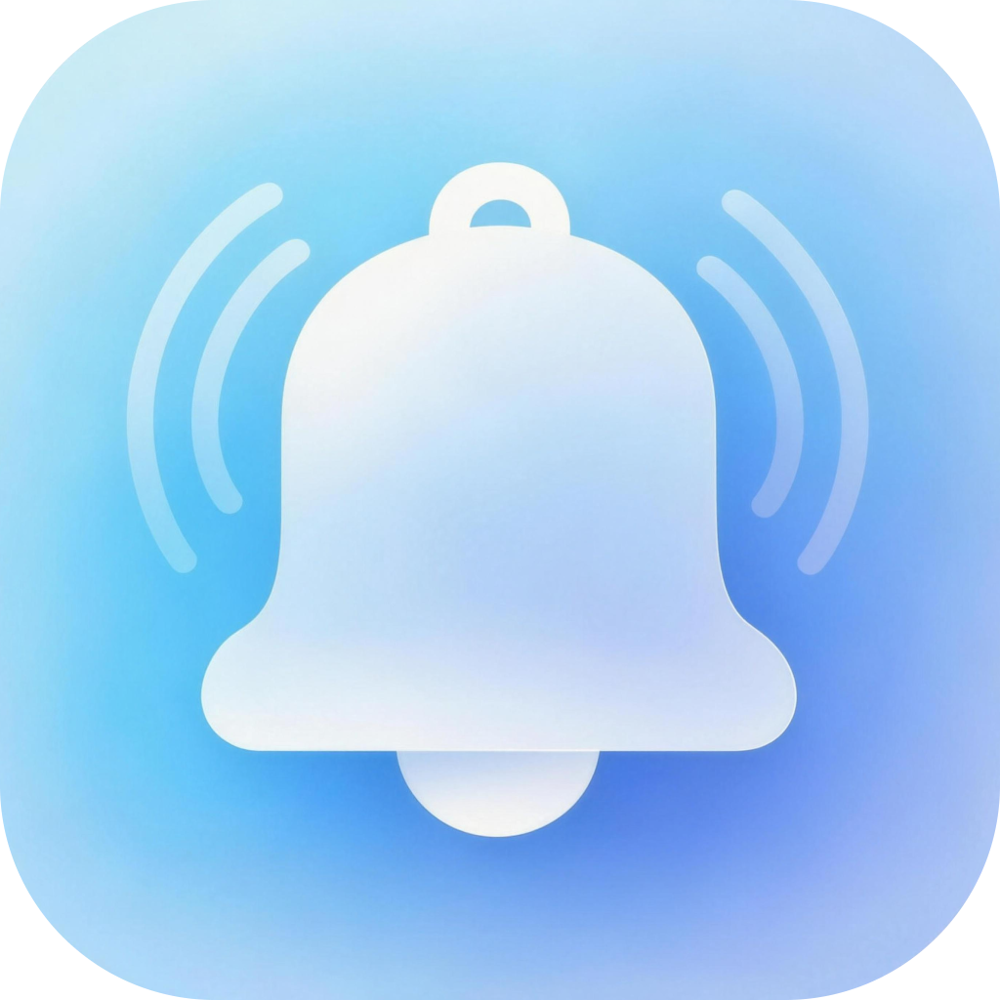

<p align="center">
  
</p>

<h1 align="center">Take Five（片刻）</h1>

<p align="center">
  <strong>Stop staring at your screen. Your phone will tell you when to come back.</strong><br>
  Works quietly in the background · iPhone push notifications · No babysitting required
</p>

<p align="center">
  <a href="#-english">English</a> | <a href="#-简体中文">简体中文</a>
</p>

<p align="center">
  <a href="https://github.com/XianShengXingGe/Take-Five/releases/tag/v0.6.0"></a>
  
  
  
  
</p>

---

<a id="-english"></a>
## 🌟 English

### 🚀 What's New in v0.6.0

- **🎨 Platform Native Design & Adaptive Light/Dark Themes**:
  - **macOS**: Fully rewritten in SwiftUI adhering strictly to Apple Human Interface Guidelines (HIG). Seamlessly adapts between Light and Dark mode with native system materials, rounded cards, and SF Pro typography.
  - **Windows**: Modern Windows 11 Fluent 2 design language with dynamic registry-based light/dark theme detection, layered acrylic elevation, and clean Segoe UI Variable typography.
- **💻 Dual Windows Architectures & Lean Apple Silicon macOS**:
  - **Windows ARM64**: Native `TakeFive-v0.6.0-win-arm64.zip` for Snapdragon X Elite, Surface Pro, and Copilot+ PCs, eliminating emulation battery drain and lag.
  - **Windows x64**: `TakeFive-v0.6.0-win-x64.zip` built with .NET 8 single-file compression and dead-code trimming, slashing package size from >160MB to ~90MB.
  - **macOS Apple Silicon**: `TakeFive-v0.6.0-macOS.dmg` targets pure `arm64`, with embedded Node.js debugging symbols stripped (saving >23MB) and packaged with UDZO zlib-9 compression (~47MB).
- **🔔 Standardized Menu Bar & System Tray UX**:
  - **macOS**: Menu bar accessory uses an 18x18 monochrome vector Template icon (`isTemplate = true`) that dynamically adapts to light and dark menu bars, featuring a mute slash indicator and unconfigured status dot.
  - **Windows**: Colorful, crisp official bell icon (`app.ico`) in the taskbar notification area, eliminating GDI handle leaks via `DestroyIcon`.
  - **Minimal 3-Item Context Menu**: Quick access simplified to "Open Dashboard", "Global Notifications (Click to Mute / Enable)", and "Quit Take Five".
- **📝 Spacious Bark Input & Seamless Clipboard Support**:
  - Full-width Bark endpoint input field with instant "Paste from Clipboard", "Clear", and "Test Push" buttons.
  - Full keyboard shortcuts (`Cmd+V`, `Cmd+C`, `Cmd+A` on macOS; `Ctrl+V`, `Ctrl+C` on Windows) and right-click context menu even in macOS accessory mode without a standard app menu bar.
  - Instant auto-save on Enter and blur (clicking outside) with real-time "Saved" status badge.
- **🗂️ Unified Settings & Zero-Friction Cold Start**:
  - Dashboard restructured into 4 intuitive cards: `🤖 Agent Platform`, `🔔 Notification Rules`, `⚙️ General Settings` (Bark endpoint, launch at startup, language toggle), and `❤️ Support & Sponsor`.
  - Zero-friction cold start: launches directly into the dashboard with the Bark input highlighted, retiring the cumbersome 4-step wizard.

---

### Why Take Five?

AI coding agents are getting powerful — but they still need you. They pause when they have a question. They stop when something goes wrong. They finish and wait in silence.

Most people deal with this in one of two ways: stare at the screen and wait, or walk away and miss the moment. **Take Five** is a third option.

---

### 🔔 The Problem: You're Either Waiting or Missing

- **The frustration**:  
  Your agent is running a task that might take 2 minutes or 20. You don't want to walk away — what if it needs you? But if you keep watching, you're just wasting time staring at a screen.  
  Or you do step away, and it gets stuck waiting for your input. You come back 30 minutes later to find it's been idle the whole time.

- **How Take Five helps**:  
  The moment your agent finishes, gets stuck, or hits an error — your iPhone buzzes. You'll know exactly when to come back, without hovering over your computer.  
  Set it up once, then forget about it. Take Five runs silently in the background and only speaks up when it matters.

---

### 📲 What Triggers a Notification?

Take Five watches your agent for four types of events:

| Event | What it means |
|---|---|
| ✅ Task completed | Your agent finished its work |
| ⌨️ Waiting for input | Your agent is asking you a question |
| 🔐 Waiting for permission | Your agent needs your approval to proceed |
| ❌ Task failed | Something went wrong |

---

### 📥 Download & Setup

**Step 1 — Get the Bark app on your iPhone**

[Bark](https://apps.apple.com/app/bark-custom-notifications/id1403753865) is a free iOS app that receives push notifications. Install it, then open it — you'll see a URL that looks like:

```
https://api.day.app/YOUR_KEY/
```

Copy it. You'll need it in Step 3.

**Step 2 — Install Take Five on macOS or Windows**

- **macOS (Apple Silicon)**: download `TakeFive-v0.6.0-macOS.dmg`, drag **Take Five.app** to your **Applications** folder (or double-click **一键安装 Take Five**).
- **Windows (x64)**: download `TakeFive-v0.6.0-win-x64.zip`, extract it, and double-click **TakeFive\TakeFive.exe** (or run **Install Take Five.cmd**).
- **Windows (ARM64 / Copilot+ PC)**: download `TakeFive-v0.6.0-win-arm64.zip`, extract it, and double-click **TakeFive\TakeFive.exe**.

> 💡 Built-in standalone runtime: no Node.js installation required. Double-click and enjoy!

**Step 3 — Configure Bark in seconds**

Open Take Five from your menu bar or system tray:
1. Paste your Bark URL or device Key directly into the wide Bark input box under **General Settings** (or click the **Paste** button).
2. Take Five auto-saves on Enter or blur, confirms with a "Saved" badge, and sends an instant test push to your phone.

That's it. Take Five automatically discovers and wires itself into your coding agents.

---

### 🖥️ Commands

Once installed, open any terminal:

| Command | What it does |
|---|---|
| `takefive status` | Check connection status and which agents are active |
| `takefive test` | Send a test notification to your phone |
| `takefive config` | Change language, notification rules, and more |
| `takefive enable codex` / `takefive on codex` | Turn notifications on for one agent |
| `takefive disable codex` / `takefive off codex` | Turn notifications off for one agent |
| `takefive enable --all` / `takefive disable --all` | Turn all four agents on or off |
| `takefive repair` | Fix hooks if an agent update broke them |
| `takefive uninstall` | Remove everything cleanly |

The enable/disable commands are instant central soft switches: they update only
Take Five's own configuration and leave the agents' hook files untouched. This
makes repeated switching fast and avoids unnecessary third-party config writes.

---

### 🤝 Supported Agents

| Agent | Official integration | Event coverage |
|---|---|---|
| [Claude Code](https://code.claude.com/docs/en/hooks) | Shared `~/.claude/settings.json` hooks | Complete, except waiting-input is native for background agents only |
| [Codex](https://developers.openai.com/codex/hooks) | User-level `~/.codex/hooks.json` | Task completed + waiting permission; review/trust once in `/hooks` |
| [OpenCode](https://opencode.ai/docs/plugins/) | Global local plugin | Task completed + waiting permission + task failed |
| [Antigravity](https://antigravity.google/docs/hooks/) | Named global hook | All four events |

Take Five reports only lifecycle events exposed by each agent's official extension API. It does not infer a failure or question from model text, avoiding false alerts.

---

<a id="-简体中文"></a>
## 🇨🇳 简体中文

### 🚀 v0.6.0 版本更新内容

- **🎨 平台原生设计与动态深浅色自适应（macOS HIG 与 Windows Fluent 2）**：
  - **macOS**：完全基于 SwiftUI 原生控件重构，深度契合 Apple 人机交互指南（HIG），界面跟随系统在浅色与深色主题间无缝自适应，彻底告别原先固定深色玻璃黑框；
  - **Windows**：深度遵循 Windows 11 Fluent 2 设计语言，实时感知系统深浅色注册表配置，采用现代分层微光卡片与 Segoe UI 字体阶梯。
- **💻 Windows 双架构原生支持与安装包极致瘦身**：
  - **Windows ARM64 原生支持**：提供专为骁龙 X Elite、Surface Pro 及 Copilot+ PC 编译的 `TakeFive-v0.6.0-win-arm64.zip`，告别 x64 模拟运行开销与耗电；
  - **Windows x64 极致精简**：针对 64 位 Intel/AMD 平台提供 `TakeFive-v0.6.0-win-x64.zip`，启用 .NET 8 单文件深度压缩与修剪，包体积从 >160MB 缩减至约 90MB；
  - **macOS Apple Silicon 纯 arm64**：提供 `TakeFive-v0.6.0-macOS.dmg`，内置 Node.js 剥离调试符号（缩减 >23MB），配合 UDZO 极高压缩率，最终镜像体积收敛至 47MB。
- **🔔 托盘与菜单栏体验升级**：
  - **macOS**：采用 18x18 官方单色矢量模板图标（Template Icon），自适应浅色与深色菜单栏；静音状态呈现对角斜杠，未配置时显示贴心圆点；
  - **Windows**：托盘采用色彩鲜艳的高清官方图标（`app.ico`），引入 `DestroyIcon` 杜绝 GDI 句柄泄漏与模糊残留；
  - **极简三段式托盘菜单**：精简为“打开面板”、“全局通知（点击静音/启用）”与“退出片刻”，拒绝冗杂选项。
- **📝 全新宽幅 Bark 输入框与原生全快捷键/右键剪贴板**：
  - 常驻全宽输入框，配备一键“粘贴 / 清空 / 测试推送”直观按钮；
  - 彻底打通 macOS Accessory 无顶层菜单栏模式下的系统剪贴板链路，完整支持 `Cmd+V` / `Cmd+C` / `Cmd+A` 快捷键与右键上下文菜单；
  - 支持回车即时保存与点击外部失焦自动保存，附带即时“已保存”状态反馈。
- **🗂️ 模块架构梳理与零阻碍即刻冷启动**：
  - 面板重构为四大清晰核心卡片：`🤖 Agent 平台`、`🔔 通知规则`、`⚙️ 通用设置`（统一收纳 Bark 推送、开机自启与语言切换）、`❤️ 支持与赞赏`；
  - 首次运行不再弹窗阻断式的四步向导，直接进入主界面并自动聚焦 Bark 输入框，开箱即用。

---

### 为什么需要「片刻」？

AI 编程助手越来越能干了——但它还是离不开你。遇到问题它会停下来等你；出错了它会暂停；任务跑完了它也只是安静地等。

大多数人面对这个问题只有两种选择：盯着屏幕等，或者走开然后错过。**片刻**是第三种选择。

---

### 🔔 痛点：你要么在等，要么错过了

- **日常小烦恼**：  
  AI 助手在跑一个任务，可能要 2 分钟，也可能要 20 分钟。你不敢走开——万一它需要你怎么办？但你坐在这儿盯着屏幕，时间也是白白浪费了。  
  或者你走开了，结果它卡住等你输入。你半小时后回来，发现它就那么闲着，什么也没做。

- **片刻帮你**：  
  任务完成、卡住、出错的那一刻——你的 iPhone 立刻震动。你知道什么时候该回来，完全不用守着电脑。  
  配置一次，之后忘了它的存在。片刻默默在后台运行，只在该说话的时候才吭声。

---

### 📲 哪些情况会触发通知？

片刻监听四种事件：

| 事件 | 含义 |
|---|---|
| ✅ 任务完成 | 助手跑完了 |
| ⌨️ 等待输入 | 助手在问你问题 |
| 🔐 等待授权 | 助手需要你确认才能继续 |
| ❌ 任务失败 | 出错了 |

---

### 📥 下载与安装

**第一步 — 在 iPhone 上装 Bark**

[Bark](https://apps.apple.com/app/bark-custom-notifications/id1403753865) 是一款免费的 iOS 应用，用来接收推送通知。安装并打开后，你会看到一个推送地址，大概长这样：

```
https://api.day.app/YOUR_KEY/
```

复制好，第三步要用。

**第二步 — 在 macOS 或 Windows 上安装片刻**

- **macOS (Apple Silicon)**：下载 `TakeFive-v0.6.0-macOS.dmg`，将 **Take Five.app** 拖入 **Applications (应用程序)** 目录（或双击**一键安装 Take Five**）。
- **Windows (x64)**：下载 `TakeFive-v0.6.0-win-x64.zip`，解压后双击 **TakeFive\TakeFive.exe**（或双击 **Install Take Five.cmd**）。
- **Windows (ARM64 / Copilot+ PC)**：下载 `TakeFive-v0.6.0-win-arm64.zip`，解压后双击 **TakeFive\TakeFive.exe**。

> 💡 内置独立执行环境，用户电脑无需预先安装 Node.js 或 npm，双击即可直接使用！

**第三步 — 极速配置 Bark**

从菜单栏或托盘图标打开片刻面板：
1. 直接在**通用设置**卡片中的宽幅输入框中粘贴你的 Bark 推送地址或设备 Key（也可点击**粘贴**按钮）。
2. 输入后回车或点击窗口空白处即可自动保存，面板会提示“已保存”并立即向你的手机发送一条测试推送验证连通。

完成后，片刻自动接入你电脑上的所有 AI 助手，无需额外配置。

---

### 🖥️ 命令列表

安装完成后，在任意终端输入：

| 命令 | 说明 |
|---|---|
| `takefive status` | 查看连接状态和各助手的钩子是否正常 |
| `takefive test` | 向手机发送一条测试推送 |
| `takefive config` | 修改语言、通知规则等配置 |
| `takefive enable codex` / `takefive on codex` | 启用单个工具通知 |
| `takefive disable codex` / `takefive off codex` | 禁用单个工具通知 |
| `takefive enable --all` / `takefive disable --all` | 一次启用或禁用全部四个工具 |
| `takefive repair` | 修复因助手更新导致的钩子失效 |
| `takefive uninstall` | 完整卸载，清除所有配置和钩子 |

启用/禁用命令采用中央软开关：只修改片刻自己的配置，不反复改写各工具的
Hook 文件，因此切换即时生效、可快速恢复，也降低了第三方配置冲突风险。

---

### 🤝 支持的 AI 助手

| 助手 | 官方接入方式 | 事件覆盖 |
|---|---|---|
| [Claude Code](https://code.claude.com/docs/en/hooks) | 共用 `~/.claude/settings.json` Hooks | 基本完整；等待输入事件仅后台 Agent 原生提供 |
| [Codex](https://developers.openai.com/codex/hooks) | 用户级 `~/.codex/hooks.json` | 任务完成、等待授权；首次需在 `/hooks` 中审核并信任 |
| [OpenCode](https://opencode.ai/docs/plugins/) | 全局本地 Plugin | 任务完成、等待授权、任务失败 |
| [Antigravity](https://antigravity.google/docs/hooks/) | 全局命名 Hook | 四类事件完整覆盖 |

片刻只上报各工具官方扩展接口能够确定的生命周期事件，不根据模型文本猜测“失败”或“提问”，避免误提醒。

---

## 📄 License / 开源协议

本项目采用 [MIT License](LICENSE) 协议开源。
