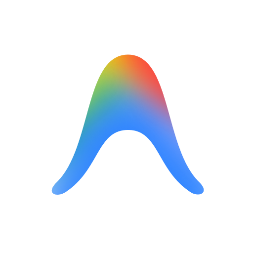

<p align="center">
  
</p>

<h1 align="center">Take Five（片刻）</h1>

<p align="center">
  <strong>Stop staring at your screen. Your phone will tell you when to come back.</strong><br>
  Works quietly in the background · iPhone push notifications · No babysitting required
</p>

<p align="center">
  <a href="#-english">English</a> | <a href="#-简体中文">简体中文</a>
</p>

<p align="center">
  <a href="https://github.com/XianShengXingGe/Take-Five/releases/latest"></a>
  
  
  
</p>

---

<a id="-english"></a>
## 🌟 English

### Why Take Five?

AI coding agents are getting powerful — but they still need you. They pause when they have a question. They stop when something goes wrong. They finish and wait in silence.

Most people deal with this in one of two ways: stare at the screen and wait, or walk away and miss the moment. **Take Five** is a third option.

---

### 🔔 The Problem: You're Either Waiting or Missing

- **The frustration**:  
  Your agent is running a task that might take 2 minutes or 20. You don't want to walk away — what if it needs you? But if you keep watching, you're just wasting time staring at a screen.  
  Or you do step away, and it gets stuck waiting for your input. You come back 30 minutes later to find it's been idle the whole time.

- **How Take Five helps**:  
  The moment your agent finishes, gets stuck, or hits an error — your iPhone buzzes. You'll know exactly when to come back, without hovering over your computer.  
  Set it up once, then forget about it. Take Five runs silently in the background and only speaks up when it matters.

---

### 📲 What Triggers a Notification?

Take Five watches your agent for four types of events:

| Event | What it means |
|---|---|
| ✅ Task completed | Your agent finished its work |
| ⌨️ Waiting for input | Your agent is asking you a question |
| 🔐 Waiting for permission | Your agent needs your approval to proceed |
| ❌ Task failed | Something went wrong |

---

### 📥 Download & Setup

**Step 1 — Get the Bark app on your iPhone**

[Bark](https://apps.apple.com/app/bark-custom-notifications/id1403753865) is a free iOS app that receives push notifications. Install it, then open it — you'll see a URL that looks like:

```
https://api.day.app/YOUR_KEY/
```

Copy it. You'll need it in Step 3.

**Step 2 — Install Take Five on your Mac**

1. Download `TakeFive-0.1-macOS.dmg` from the [Releases](https://github.com/XianShengXingGe/Take-Five/releases) page.
2. Open the DMG and double-click **一键安装 Take Five**.

> ⚠️ Requires [Node.js](https://nodejs.org) (v18 or later). If you don't have it, download the LTS version from nodejs.org first.

**Step 3 — Run the setup wizard**

The installer walks you through two things:
1. Paste your Bark URL — Take Five will send a test notification to confirm your phone is connected.
2. Choose your notification language — English or Chinese.

That's it. Take Five wires itself into your coding agent automatically.

---

### 🖥️ Commands

Once installed, open any terminal:

| Command | What it does |
|---|---|
| `takefive status` | Check connection status and which agents are active |
| `takefive test` | Send a test notification to your phone |
| `takefive config` | Change language, notification rules, and more |
| `takefive repair` | Fix hooks if an agent update broke them |
| `takefive uninstall` | Remove everything cleanly |

---

### 🤝 Supported Agents

| Agent | Status |
|---|---|
| [Antigravity](https://antigravity.dev) | ✅ Fully tested |
| Claude Code | ⚠️ Integrated, not fully tested |
| Codex | ⚠️ Integrated, not fully tested |
| OpenCode | ⚠️ Integrated, not fully tested |

> **v0.1 note:** Only Antigravity has been fully tested in this release. Other agents are integrated but may have rough edges. Please open an [issue](https://github.com/XianShengXingGe/Take-Five/issues) if you run into problems.

---

<a id="-简体中文"></a>
## 🇨🇳 简体中文

### 为什么需要「片刻」？

AI 编程助手越来越能干了——但它还是离不开你。遇到问题它会停下来等你；出错了它会暂停；任务跑完了它也只是安静地等。

大多数人面对这个问题只有两种选择：盯着屏幕等，或者走开然后错过。**片刻**是第三种选择。

---

### 🔔 痛点：你要么在等，要么错过了

- **日常小烦恼**：  
  AI 助手在跑一个任务，可能要 2 分钟，也可能要 20 分钟。你不敢走开——万一它需要你怎么办？但你坐在这儿盯着屏幕，时间也是白白浪费了。  
  或者你走开了，结果它卡住等你输入。你半小时后回来，发现它就那么闲着，什么也没做。

- **片刻帮你**：  
  任务完成、卡住、出错的那一刻——你的 iPhone 立刻震动。你知道什么时候该回来，完全不用守着电脑。  
  配置一次，之后忘了它的存在。片刻默默在后台运行，只在该说话的时候才吭声。

---

### 📲 哪些情况会触发通知？

片刻监听四种事件：

| 事件 | 含义 |
|---|---|
| ✅ 任务完成 | 助手跑完了 |
| ⌨️ 等待输入 | 助手在问你问题 |
| 🔐 等待授权 | 助手需要你确认才能继续 |
| ❌ 任务失败 | 出错了 |

---

### 📥 下载与安装

**第一步 — 在 iPhone 上装 Bark**

[Bark](https://apps.apple.com/app/bark-custom-notifications/id1403753865) 是一款免费的 iOS 应用，用来接收推送通知。安装并打开后，你会看到一个推送地址，大概长这样：

```
https://api.day.app/YOUR_KEY/
```

复制好，第三步要用。

**第二步 — 在 Mac 上安装片刻**

1. 从 [Releases 页面](https://github.com/XianShengXingGe/Take-Five/releases) 下载 `TakeFive-0.1-macOS.dmg`。
2. 打开 DMG，双击**一键安装 Take Five**。

> ⚠️ 需要提前安装 [Node.js](https://nodejs.org)（v18 及以上）。如果没有，先去 nodejs.org 下载 LTS 版本。

**第三步 — 运行配置向导**

安装程序会引导你完成两件事：
1. 粘贴你的 Bark 地址——片刻会发一条测试推送，确认手机连通正常。
2. 选择通知语言——支持中文和英文。

完成后，片刻自动接入你的 AI 助手，不需要任何额外操作。

---

### 🖥️ 命令列表

安装完成后，在任意终端输入：

| 命令 | 说明 |
|---|---|
| `takefive status` | 查看连接状态和各助手的钩子是否正常 |
| `takefive test` | 向手机发送一条测试推送 |
| `takefive config` | 修改语言、通知规则等配置 |
| `takefive repair` | 修复因助手更新导致的钩子失效 |
| `takefive uninstall` | 完整卸载，清除所有配置和钩子 |

---

### 🤝 支持的 AI 助手

| 助手 | 状态 |
|---|---|
| [Antigravity](https://antigravity.dev) | ✅ 已完整测试 |
| Claude Code | ⚠️ 已接入，未完整测试 |
| Codex | ⚠️ 已接入，未完整测试 |
| OpenCode | ⚠️ 已接入，未完整测试 |

> **v0.1 说明：** 目前只有 Antigravity 经过完整测试。其他助手已接入但可能有问题，欢迎提 [issue](https://github.com/XianShengXingGe/Take-Five/issues) 反馈。

---

## 📄 License / 开源协议

本项目采用 [MIT License](LICENSE) 协议开源。
